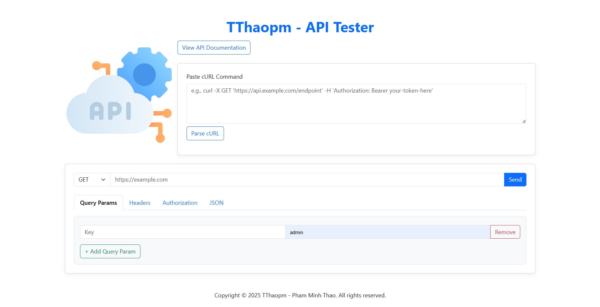

# TThaopm - API Tester

A lightweight web application that allows you to easily send HTTP requests (GET, POST, PUT, PATCH, DELETE) to any API and view the response in a clean, user-friendly interface.

### Production: [Visit Production Site: thaopm-rtc-meeting.onrender.com](https://thaopm-rtc-meeting.onrender.com)

## Features

- Quickly send HTTP requests to any URL
- Support for all major HTTP methods: `GET`, `POST`, `PUT`, `PATCH`, `DELETE`
- Easily add **Query Parameters** and **Request Headers**
- Compose and send **JSON request bodies**
- Display detailed response info:
  -  Status code
  -  Response time
  -  Response size
  -  Response body and headers
- **Download response JSON as a file** for debugging, sharing, or saving

## Built With

- HTML5, CSS3, JavaScript (ES6+)
- [Bootstrap 5.3](https://getbootstrap.com/)
- [Snowpack](https://www.snowpack.dev/) for frontend bundling
- Google Fonts (Inter)

## Getting Started

### 1. Clone the project

```bash
git clone https://github.com/your-username/tthaopm-api-tester.git
cd tthaopm-api-tester
```

### 2. Install dependencies

```bash
yarn install
```

### 3. Run development server

```bash
yarn start
```

### 4. Build for production

```bash
yarn build
```

## Project Structure

```
.
├── public/              # Static assets (e.g. favicon)
├── index.html           # Main interface
├── script.js            # Request logic and UI handling
├── package.json         # Project metadata and scripts
└── README.md            # This file
```

## Save JSON Feature

After receiving a response, click the **"Save JSON"** button to download the response body as a `.json` file.  
The filename will be timestamped like: `response-2025-06-19T07-27-44.json`.

## Notes

- This tool is client-side only — your data stays on your machine.
- You can test with public APIs like:
  - https://jsonplaceholder.typicode.com
  - https://reqres.in
  - https://dog.ceo/api

## Author

- Pham Minh Thao – [LinkedIn](https://www.linkedin.com/in/mtpe-minhthaopham/)
- Live demo: [https://thaopm-api-tester.onrender.com](https://thaopm-api-tester.onrender.com)

---

If you find this tool useful, please consider giving it a star 🌟 or sharing it with others who work with APIs!
